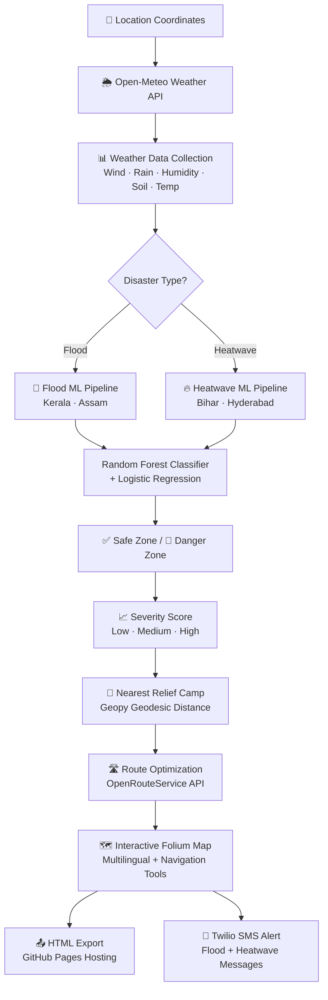
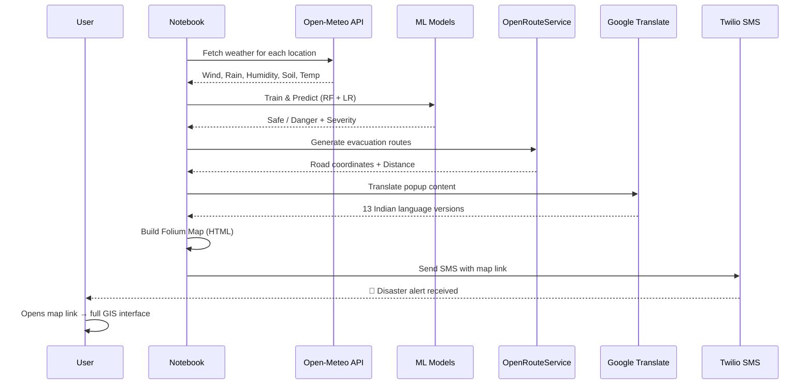
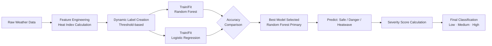

<div align="center">

# 🛡️ GUARDIANS OF DISASTERS (GOD)
### AI-Driven Multi-Disaster Emergency Response System

[](https://python.org)
[](https://colab.research.google.com)
[](https://python-visualization.github.io/folium/)
[](https://scikit-learn.org)
[](https://twilio.com)
[](LICENSE)
[](https://vvit.net)

> **Real-time flood and heatwave detection using Machine Learning, interactive GIS maps, multilingual emergency alerts, and automated SMS notifications — all in a single Python notebook.**

[🗺️ Live Flood Map](outputs/flood_map.html) · [🔥 Live Heatwave Map](outputs/heatwave_map.html) · [📄 Project Report](docs/Project_Report.pdf) · [📓 Notebook](notebooks/Guardians_of_Disasters.ipynb)

</div>

---

## 📋 Table of Contents

- [Overview](#-overview)
- [Problem Statement](#-problem-statement)
- [Objectives](#-objectives)
- [Key Features](#-key-features)
- [System Architecture](#-system-architecture)
- [Workflow](#-workflow)
- [Technology Stack](#-technology-stack)
- [Folder Structure](#-folder-structure)
- [Datasets](#-datasets)
- [Machine Learning Pipeline](#-machine-learning-pipeline)
- [Interactive Map Features](#-interactive-map-features)
- [Multilingual Support](#-multilingual-support)
- [SMS Alert System](#-sms-alert-system)
- [Installation & Setup](#-installation--setup)
- [Running the Project](#-running-the-project)
- [Screenshots](#-screenshots)
- [Results](#-results)
- [Real-World Applications](#-real-world-applications)
- [Limitations](#-limitations)
- [Future Enhancements](#-future-enhancements)
- [Security](#-security)
- [Contributing](#-contributing)
- [License](#-license)
- [Acknowledgements](#-acknowledgements)
- [Authors](#-authors)

---

## 🌍 Overview

**Guardians of Disasters (GOD)** is an AI-powered emergency response platform developed using Python and Google Colab as a B.Tech Machine Learning Lab project at VVIT, Nambur.

The system combines **machine learning**, **real-time weather analysis**, **GIS visualization**, **route optimization**, **multilingual communication**, and **SMS alerting** into a unified disaster management platform. It handles two disaster types through completely separate analytical pipelines:

| Pipeline | Disaster | Regions |
|---|---|---|
| 🌊 Flood Module | Flood / Cyclone | Kerala (Malappuram), Assam (Dhubri) |
| 🔥 Heatwave Module | Extreme Heat | Bihar, Hyderabad (Telangana) |

The final output is two interactive HTML maps that can be hosted on GitHub Pages and accessed on any device.

---

## 🚨 Problem Statement

Natural disasters like floods and heatwaves cause widespread devastation in India every year. Existing emergency systems suffer from:

- ❌ Region-wide alerts instead of **location-specific** warnings
- ❌ No **interactive evacuation guidance**
- ❌ No real-time **relief camp identification**
- ❌ **Language barriers** — alerts in only 1–2 languages
- ❌ No integration of **weather data with navigation**
- ❌ Dependence on **manual analysis** rather than intelligent models

This project addresses all these gaps with an intelligent, data-driven, multilingual platform.

---

## 🎯 Objectives

1. Analyze real-time environmental conditions using Open-Meteo weather API
2. Classify locations into **Safe Zones** and **Danger Zones** using ML
3. Predict disaster **severity** (Low / Medium / High)
4. Recommend **nearest relief camps** using geodesic distance
5. Generate **optimized evacuation routes** via OpenRouteService
6. Deliver **multilingual emergency information** in 13 Indian languages
7. Send **SMS disaster alerts** via Twilio
8. Provide an **interactive disaster response map** accessible on any device

---

## ✨ Key Features

### 🌦️ Weather Data Collection
- Real-time data from **Open-Meteo API** (no key required)
- Parameters: Wind Speed, Precipitation, Relative Humidity, Soil Moisture, Temperature
- **Heat Index** calculation: `HI = Temperature + (0.33 × Humidity) − 0.7`

### 🤖 AI-Based Zone Classification
- **Random Forest Classifier** (primary model) + Logistic Regression (comparison)
- Dynamic threshold-based labeling (no hardcoded thresholds — adapts to real data)
- Separate models for **Flood** and **Heatwave** disaster types

### 📊 Severity Assessment
| Level | Flood Score | Heatwave Temp | Map Color |
|---|---|---|---|
| Low | ≤ 2 | < 35°C | 🟡 Yellow |
| Medium | 3–5 | 35–44°C | 🟠 Orange |
| High | ≥ 6 | ≥ 45°C | 🔴 Red |

### 🗺️ Interactive GIS Maps (Folium)
- ✅ Safe Zone markers (green circles)
- 🚨 Danger Zone markers (color-coded by severity)
- 🏫 Relief Camp markers (blue icons)
- 🔵 **Blue routes**: Danger Zone → Nearest Relief Camp
- 🟣 **Purple routes**: Safe Zone → 3 Nearest Danger Zones (for rescue teams)
- Popup cards with distance and estimated travel time

### 🏫 Relief Camp Recommendation
- Government schools and public buildings used as shelters
- Camp coordinates auto-generated by shifting location 1 km north/east
- Nearest camp found using **Geopy geodesic distance**

### 🛣️ Route Optimization (OpenRouteService)
- Real-world road routing (not straight-line)
- Supports driving and walking modes
- Route info popups: From → To, Distance (km), Duration (min)

### 🧭 Navigation Tools
- **MiniMap** compass in map corner
- **MeasureControl** — click any two points to measure distance

### 🌐 Multilingual Support
- 13 Indian languages via Google Translate (Deep Translator)
- Language selector dropdown embedded in map
- All popups and route info update **dynamically without reloading**

### 📱 SMS Alert System (Twilio)
- Automated SMS with live map link
- Separate alerts for Flood and Heatwave events
- Works globally; targeted delivery

### 📤 GitHub Pages Compatible
- Both HTML maps export and host for free
- Accessible on mobile, tablet, and desktop

---

## 🏗️ System Architecture



---

## 🔄 Workflow



---

## 🛠️ Technology Stack

| Category | Technology | Purpose |
|---|---|---|
| Language | Python 3.x | Core development |
| Platform | Google Colab | Cloud execution |
| Data | Pandas, NumPy | Data processing |
| ML | Scikit-learn | Classification models |
| GIS | Folium, Leaflet.js | Interactive maps |
| Distance | Geopy | Geodesic calculations |
| Routing | OpenRouteService | Road route generation |
| Weather | Open-Meteo API | Real-time weather data |
| Translation | Deep Translator | 13 Indian languages |
| SMS | Twilio | Emergency notifications |
| Frontend | HTML, JavaScript, JSON | Map interactivity |
| Hosting | GitHub Pages | Free web deployment |

---

## 📁 Folder Structure

```
Guardians-of-Disasters/
│
├── 📓 notebooks/
│   └── Guardians_of_Disasters.ipynb     ← Main notebook (credentials removed)
│
├── 📊 data/
│   ├── locations.csv                     ← 50 monitored locations across 4 regions
│   ├── relief_camps.csv                  ← 34 relief camp coordinates
│   └── sample_weather.csv               ← Sample weather data for offline testing
│
├── 🗺️ outputs/
│   ├── flood_map.html                    ← Interactive flood response map
│   ├── heatwave_map.html                 ← Interactive heatwave map
│   └── screenshots/
│       ├── dashboard.png
│       ├── danger_zone.png
│       ├── relief_camp.png
│       ├── route.png
│       ├── multilingual.png
│       ├── sms_alert.png
│       └── severity.png
│
├── 📂 assets/
│   ├── architecture.png
│   ├── workflow.png
│   └── logo.png
│
├── 📄 docs/
│   ├── Project_Report.pdf               ← Full academic report
│   ├── System_Architecture.md
│   ├── Workflow.md
│   └── API_Documentation.md
│
├── requirements.txt
├── .gitignore
├── LICENSE
└── README.md
```

---

## 📊 Datasets

### `data/locations.csv`
50 locations across 4 regions used for monitoring:

| Region | Disaster Type | No. of Locations |
|---|---|---|
| Kerala (Malappuram) | Flood | 19 |
| Assam (Dhubri) | Flood | 15 |
| Bihar (multiple) | Heatwave | 16 |
| Hyderabad (Telangana) | Heatwave | 11 |

**Columns**: `location, lat, lon, state, district`

### `data/relief_camps.csv`
34 relief camps (government schools, panchayat offices):

**Columns**: `name, lat, lon, type, capacity, state`

### `data/sample_weather.csv`
Sample weather readings for testing without API calls:

**Columns**: `location, lat, lon, temperature, wind_speed, precipitation, humidity, soil_moisture, heat_index, zone_type, ml_prediction, severity`

---

## 🤖 Machine Learning Pipeline



### Model Performance
Both models are trained on the same dataset and accuracy is printed at runtime:

```
🌊 Flood Accuracy  → RF: X.XX   LR: X.XX
🔥 Heatwave Accuracy → RF: X.XX   LR: X.XX
```

*(Accuracy varies with real-time weather data)*

### Flood Classification Thresholds
```python
# A location is DANGER if:
wind_speed    >= 40 km/h    OR
precipitation >= 10 mm       OR
humidity      >= 85%         OR
soil_moisture >= 0.3 m³/m³
```

---

## 🗺️ Interactive Map Features

| Feature | Description |
|---|---|
| ✅ Safe Zone (green circle) | Location with all parameters within safe limits |
| 🚨 Danger Zone (color circle) | Location exceeding one or more thresholds |
| 🏫 Relief Camp (blue marker) | Government school / public building shelter |
| 🔵 Blue route | Danger Zone → Nearest Relief Camp evacuation path |
| 🟣 Purple route | Safe Zone → 3 Nearest Danger Zones (for rescue teams) |
| 📍 Popup info | Zone name, severity, route distance, duration |
| 🧭 MiniMap | Orientation compass in map corner |
| 📏 Measure Tool | Click-to-measure any distance on the map |
| 🌐 Language Selector | Dropdown to switch all text to 13 languages |

---

## 🌐 Multilingual Support

The language selector is embedded as a custom HTML dropdown in the top-left of the map. Selecting a language updates **all popup text instantly** using pre-translated JSON stored in each marker's `data-translate` attribute.

**Supported Languages:**

| | | | |
|---|---|---|---|
| English | Hindi | Tamil | Telugu |
| Kannada | Malayalam | Bengali | Marathi |
| Gujarati | Punjabi | Urdu | Assamese |
| Odia | | | |

---

## 📱 SMS Alert System

Two separate SMS functions are implemented:

```python
send_flood_alert_sms()      # → Sends flood warning + flood_map.html link
send_heatwave_alert_sms()   # → Sends heatwave warning + heatwave_map.html link
```

**Message format:**
```
🚨 Disaster Alert: Immediate Attention Required 🚨
Check the interactive disaster map here:
https://yourusername.github.io/repo-name/outputs/flood_map.html
```

---

## ⚙️ Installation & Setup

### Option A — Google Colab (Recommended)

1. Open the notebook in Colab:  
   [](https://colab.research.google.com/github/YOUR_USERNAME/Guardians-of-Disasters/blob/main/notebooks/Guardians_of_Disasters.ipynb)

2. Run Cell 1 to install all libraries
3. Set API keys using Colab Secrets (🔑 icon in left sidebar):
   - `ORS_API_KEY`
   - `TWILIO_ACCOUNT_SID`
   - `TWILIO_AUTH_TOKEN`
   - `TWILIO_NUMBER`
   - `RECIPIENT_NUMBER`

### Option B — Local Setup

```bash
# Clone the repository
git clone https://github.com/YOUR_USERNAME/Guardians-of-Disasters.git
cd Guardians-of-Disasters

# Install dependencies
pip install -r requirements.txt

# Set environment variables
export ORS_API_KEY="your_ors_api_key"
export TWILIO_ACCOUNT_SID="your_twilio_sid"
export TWILIO_AUTH_TOKEN="your_twilio_token"
export TWILIO_NUMBER="your_twilio_number"
export RECIPIENT_NUMBER="recipient_phone_number"

# Launch notebook
jupyter notebook notebooks/Guardians_of_Disasters.ipynb
```

---

## 🚀 Running the Project

Run cells in order:

| Cell | Description |
|---|---|
| Cell 1 | Install all libraries |
| Cell 2 | Define Kerala flood locations |
| Cell 3 | Define Dhubri (Assam) flood locations |
| Cell 4 | Define Bihar heatwave locations |
| Cell 5 | Define relief camps (Kerala) |
| Cell 6 | Fetch weather data + Train ML models |
| Cell 7 | Calculate severity scores |
| Cell 8 | Generate relief camp coordinates |
| Cell 9 | Build interactive maps (Flood + Heatwave) |
| Cell 10 | Save + Download HTML maps |
| Cell 11 | Send Flood SMS alert |
| Cell 12 | Send Heatwave SMS alert |

> **To switch regions**: Change `flood_locations = kerla_locations` to `dhubri_locations`, or `heat_locations = bihar_locations` to `hyderabad_locations` in Cell 6.

---

## 📸 Screenshots

### Dashboard — Full Disaster Map
> *Screenshot: outputs/screenshots/dashboard.png*  
> Shows the full interactive map with all zones, routes, and the language dropdown visible.

### Danger Zone Markers
> *Screenshot: outputs/screenshots/danger_zone.png*  
> Color-coded danger zones: yellow (Low), orange (Medium), red (High) with popup showing severity.

### Relief Camp Markers
> *Screenshot: outputs/screenshots/relief_camp.png*  
> Blue icon markers representing government school relief camps with popup info.

### Route Generation
> *Screenshot: outputs/screenshots/route.png*  
> Blue polyline from danger zone to nearest relief camp with distance and duration popup.

### Multilingual Interface
> *Screenshot: outputs/screenshots/multilingual.png*  
> Language dropdown expanded showing 13 Indian languages with Telugu selected.

### SMS Alert on Mobile
> *Screenshot: outputs/screenshots/sms_alert.png*  
> Alert SMS received on mobile showing disaster warning and live map link.

### Severity Classification
> *Screenshot: outputs/screenshots/severity.png*  
> Side-by-side view of Low, Medium, and High severity danger zones on the map.

### Heatwave Map
> *Screenshot: outputs/screenshots/heatwave_map.png*  
> Separate heatwave map for Bihar/Hyderabad showing orange/yellow severity circles.

---

## 📈 Results

The system was successfully tested with real-time weather data and produced:

- ✅ **Interactive Flood Map** (`flood_map.html`) — hosted on GitHub Pages
- ✅ **Interactive Heatwave Map** (`heatwave_map.html`) — hosted on GitHub Pages
- ✅ **ML Predictions** for all locations with severity scores
- ✅ **Evacuation routes** generated via OpenRouteService
- ✅ **SMS alerts** delivered via Twilio to verified numbers
- ✅ **Multilingual popups** in 13 Indian languages

---

## 🌏 Real-World Applications

| Domain | Application |
|---|---|
| 🏛️ Government | Integration with NDMA, SDMA state disaster portals |
| 🏥 NGOs | Coordination of relief operations and camp logistics |
| 🏫 Schools / Universities | Evacuation planning and community awareness |
| 🌆 Smart Cities | Real-time public safety dashboards |
| 📡 Media | Journalists covering disaster zones |
| 🔬 Research | Dataset for disaster ML research |

---

## ⚠️ Limitations

- **Twilio trial account** limits SMS to verified numbers only; a paid account is needed for broadcast
- **OpenRouteService free tier** allows 2,000 requests/day; heavy use requires upgrading
- The system currently covers **4 specific regions** — extending to new areas requires adding location data
- **ML models retrain on each run** — no persistence of trained model between sessions
- Weather data is fetched at **hourly intervals**; true real-time streaming is not yet implemented
- Translation accuracy depends on **Google Translate quality** for regional languages

---

## 🔮 Future Enhancements

- [ ] Add **real-time data streaming** with cron-based auto-refresh
- [ ] Integrate **IoT sensor data** (river gauges, soil sensors)
- [ ] Expand to **cyclone, landslide, and earthquake** modules
- [ ] Build a **web dashboard** (Flask/FastAPI) for live monitoring
- [ ] Add **WhatsApp alerts** via Twilio WhatsApp API
- [ ] Support **push notifications** via Firebase
- [ ] Implement **model persistence** (save trained ML models with joblib)
- [ ] Add **NDMA / IMD data integration** for official weather feeds
- [ ] Build a **mobile app** (React Native / Flutter)
- [ ] Add **population density overlay** to prioritize high-risk zones
- [ ] Support **all 22 official Indian languages**

---

## 🔒 Security

> ⚠️ **This repository does NOT contain any real API keys or credentials.**

All credentials in the original notebook have been replaced with environment variable lookups:

```python
# Safe pattern used in this notebook:
import os
account_sid = os.environ.get('TWILIO_ACCOUNT_SID', 'YOUR_TWILIO_ACCOUNT_SID')
auth_token  = os.environ.get('TWILIO_AUTH_TOKEN',  'YOUR_TWILIO_AUTH_TOKEN')
ors_key     = os.environ.get('ORS_API_KEY',         'YOUR_ORS_API_KEY')
```

**If you fork this repo, never commit real credentials.** If you accidentally do, revoke those keys immediately.

---

## 🤝 Contributing

Contributions are welcome! Here's how:

1. Fork the repository
2. Create a feature branch: `git checkout -b feature/your-feature`
3. Commit your changes: `git commit -m "Add your feature"`
4. Push to branch: `git push origin feature/your-feature`
5. Open a Pull Request

### Contribution Ideas
- Add new location datasets for more Indian states
- Improve ML model accuracy with feature engineering
- Add new disaster type modules (cyclone, landslide)
- Write unit tests
- Improve translation coverage

---

## 📄 License

This project is licensed under the **MIT License** — see [LICENSE](LICENSE) for details.

---

## 🙏 Acknowledgements

- **Mrs. M Ramya Harika** — Course Instructor, ECE Department, VVIT
- **Dr. Sk. Enaul Haq** — Head of the Department, ECE, VVIT
- [Open-Meteo](https://open-meteo.com) — Free weather API
- [OpenRouteService](https://openrouteservice.org) — Routing API
- [Folium](https://python-visualization.github.io/folium/) — Interactive maps
- [Twilio](https://twilio.com) — SMS platform
- [Deep Translator](https://pypi.org/project/deep-translator/) — Translation library
- [NDMA India](https://ndma.gov.in) — Disaster management guidelines

---

## 👨‍💻 Authors

| Name | Roll No | Institution |
|---|---|---|
| **Sk. Abdul Rajak** | 23BQ1A04E4 | VVIT, Nambur |
| **T. Kushwanth** | 24BQ5A0420 | VVIT, Nambur |
| **V. Jaswanth** | 23BQ1A04H3 | VVIT, Nambur |

**Department**: Electronics and Communication Engineering  
**University**: Jawaharlal Nehru Technological University Kakinada (JNTUK)  
**Institution**: Vasireddy Venkatadri Institute of Technology (VVIT), Nambur  
**Academic Year**: 2025–26

---

<div align="center">

Made with ❤️ for disaster preparedness and public safety

**⭐ Star this repo if you found it useful!**

</div>
